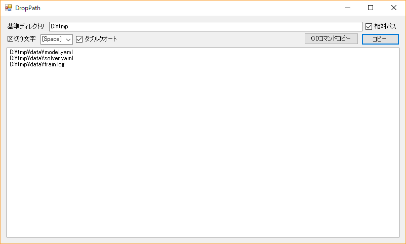

# droppath
ファイル群をドラッグドロップしてコマンドプロンプトに貼り付けられる文字列に変換

コマンドプロンプトにエクスプローラから複数ファイルをドラッグドロップしても、先頭のファイルのパスしか入力されず不便なので作ったツール



## 使い方

1. 基準ディレクトリに、コマンドプロンプトのカレントディレクトリを入力(ドラッグドロップ可能)
2. 下のテキストボックスにファイル群をドラッグドロップ
3. コピーボタンをクリックするとパスがスペース区切りでクリップボードにコピーされる

上の画像の例だと次のようになる
```
"data\model.yaml" "data\solver.yaml" "data\train.log"
```

## 備考
- ドライブが違うと相対パスへの変換は不可
- コマンドプロンプトのコマンド文字列の長さは2047文字以下 [公式](https://support.microsoft.com/ja-jp/help/830473/command-prompt-cmd-exe-command-line-string-limitation)
